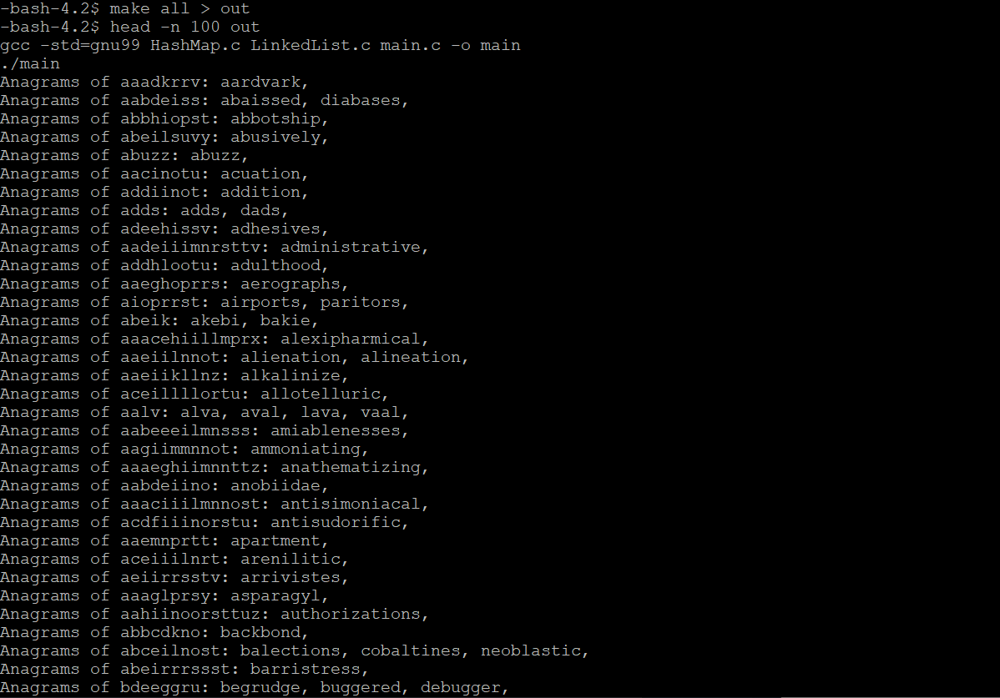

# Anagram-Hashing

## Description
This is a program that prints out all anagrams of specified strings. Two strings are anagrams if by rearranging letters of one of the strings you can obtain another. For example, "acp" and "pac" are both anagrams of the word "cap". The original strings would be provided in a "words.txt" file that contains 43,000+ different strings.


## Implementation
* Build our own Hash table. Where the key is a sorted string, and the value is a linked list of its anagrams.
* Sort each string with alphabetic order such that all anagrams would have the same key.
* If the key of a string already exists (it is an anagram of this key), append it at the end of linked list.
* Load all strings from the file into our hash table in this way.
* I used chaining to avoid collision. 
* Iterate through hash table and output all anagrams.


## How to run
* run ```make test``` to compile and run tests.
* run ```make all``` to compile and run main program. However, this command would cause tens of thousands of lines to be output to our terminal due to the size of our txt file.
* To avoid this, run ```make all > out``` to save our terminal outputs in a file called out. In addition, to check the first 100 lines of our outputs, run ```head -n 100 out``` and they would be shown to the terminal.


## Program in action

